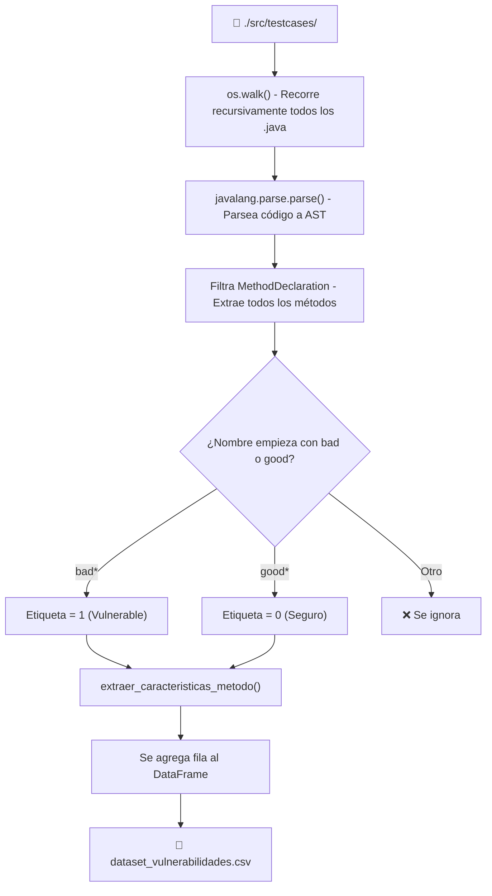
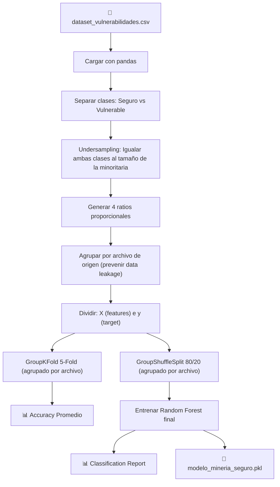
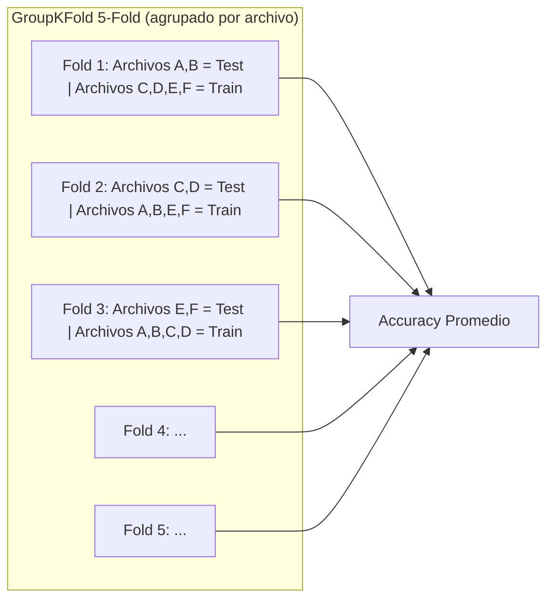

# 🛡️ Guía Técnica: Pipeline de Machine Learning para Detección de Vulnerabilidades en Java

## Resumen General

Este documento describe el pipeline completo de **minería de datos y aprendizaje automático** diseñado para detectar vulnerabilidades de seguridad en código fuente Java. El sistema analiza el **Abstract Syntax Tree (AST)** de métodos Java, extrae características numéricas estructurales y entrena un clasificador **Random Forest** para predecir si un método es **Vulnerable** o **Seguro**.

---

## 1. Origen de los Datos: Juliet Test Suite for Java 1.3

| Atributo | Detalle |
|---|---|
| **Nombre oficial** | Juliet Test Suite for Java – Version 1.3 |
| **Organización** | NIST (National Institute of Standards and Technology) – Software Assurance Reference Dataset (SARD) |
| **Casos de prueba** | ~450,000 casos de prueba |
| **Propósito** | Benchmark estandarizado para evaluar herramientas de análisis estático de seguridad |
| **Cobertura** | Múltiples CWEs (Common Weakness Enumerations) como inyección SQL, XSS, OS Command Injection, etc. |
| **Ubicación en el proyecto** | `./src/testcases/` |

### Convención de Nombres de Juliet

La suite Juliet sigue una **convención estricta de nombres** que es la base para el etiquetado automático del dataset:

- **Métodos `bad*()`**: Contienen código intencionalmente **vulnerable** → Etiqueta `1`
- **Métodos `good*()`**: Contienen la corrección segura del mismo patrón → Etiqueta `0`
- **Otros métodos** (`main`, utilidades, helpers): Son **ignorados** durante la extracción


---

## 2. Construcción del Dataset (`generar_dataset.py`)

### 2.1 Diagrama del Flujo de Generación



### 2.2 Parseo con `javalang`

El script utiliza la librería **`javalang`** (un parser de Java puro en Python) para convertir cada archivo `.java` en su **Árbol de Sintaxis Abstracta (AST)**. Esto permite analizar la estructura del código sin ejecutarlo.

```python
arbol = javalang.parse.parse(codigo_fuente)

for _, metodo in arbol.filter(javalang.tree.MethodDeclaration):
    nombre = metodo.name.lower()
    if nombre.startswith('bad'):
        etiqueta = 1  # Vulnerable
    elif nombre.startswith('good'):
        etiqueta = 0  # Seguro
    else:
        continue  # Se ignora
```

> [!NOTE]
> Los archivos que tienen errores de sintaxis intencionales (parte del diseño de Juliet) son capturados por un `try/except` y se contabilizan como "ignorados" sin interrumpir el proceso.

### 2.3 Funciones Peligrosas Monitoreadas

El script define una lista de **funciones Java consideradas peligrosas** que se buscan dentro de cada método:

```python
FUNCIONES_PELIGROSAS = [
    'exec',             # Ejecución de comandos del sistema operativo
    'executeQuery',     # Ejecución de consultas SQL
    'execute',          # Ejecución genérica (SQL, comandos)
    'getOutputStream',  # Escritura directa a flujos de salida
    'Socket',           # Conexiones de red
    'Runtime',          # Acceso al runtime del sistema
    'getenv'            # Lectura de variables de entorno
]
```

### 2.4 Funciones de Sanitización Monitoreadas

Además de las funciones peligrosas, el script detecta **funciones de sanitización y validación** para determinar si un método aplica contramedidas de seguridad:

```python
FUNCIONES_SANITIZACION = [
    'prepareStatement', 'setString', 'setInt',  # Parametrización SQL
    'escapeHtml', 'encodeForHTML',               # Escape de salida (XSS)
    'matches', 'compile',                        # Validación con regex
    'isValid', 'validate'                        # Validación genérica
]
```


### 2.5 Features Extraídas del AST (13 características base)

Para cada método encontrado, la función `extraer_caracteristicas_metodo()` extrae **13 features numéricas** directamente del AST:

| # | Feature | Nodo AST Analizado | Descripción |
|---|---|---|---|
| 1 | `total_nodos` | `javalang.tree.Node` | Cantidad total de nodos en el sub-árbol del método. Indica complejidad general. |
| 2 | `ast_depth` | Recursión propia | Profundidad máxima del AST del método. Indica anidamiento. |
| 3 | `llamadas_peligrosas` | `MethodInvocation` | Conteo de invocaciones a funciones de la lista `FUNCIONES_PELIGROSAS`. |
| 4 | `total_llamadas` | `MethodInvocation` | Total de invocaciones a cualquier método. |
| 5 | `num_ifs` | `IfStatement` | Número de sentencias `if`. Indica ramificación. |
| 6 | `num_loops` | `ForStatement`, `WhileStatement`, `DoStatement` | Total de bucles (`for`, `while`, `do-while`). |
| 7 | `num_catches` | `CatchClause` | Número de bloques `catch`. |
| 8 | `num_throws` | `ThrowStatement` | Número de sentencias `throw`. |
| 9 | `num_variables` | `LocalVariableDeclaration` | Variables locales declaradas en el método. |
| 10 | `num_literales` | `Literal` | Strings y números "quemados" (hardcoded) en el código. |
| 11 | `llamadas_sanitizacion` | `MethodInvocation` | Conteo de invocaciones a funciones de la lista `FUNCIONES_SANITIZACION`. |
| 12 | `tiene_sanitizacion` | Derivada | Flag binario (0/1): indica si el método usa al menos una función de sanitización. |
| 13 | `concatenacion_sql_sospechosa` | `Literal` | Conteo de literales que contienen palabras clave SQL (`SELECT`, `INSERT`, `UPDATE`, `DELETE`, `DROP`). Detecta posibles inyecciones SQL por concatenación. |

### 2.6 Cálculo de Profundidad del AST

La función `calcular_profundidad_ast()` recorre recursivamente el árbol del método:

```python
def calcular_profundidad_ast(nodo):
    if not hasattr(nodo, 'children') or not nodo.children:
        return 1  # Nodo hoja
    
    profundidad_maxima = 0
    for hijo in nodo.children:
        if isinstance(hijo, list):
            for item in hijo:
                if isinstance(item, javalang.tree.Node):
                    profundidad_maxima = max(profundidad_maxima, calcular_profundidad_ast(item))
        elif isinstance(hijo, javalang.tree.Node):
            profundidad_maxima = max(profundidad_maxima, calcular_profundidad_ast(hijo))
    
    return 1 + profundidad_maxima
```

### 2.7 Archivo de Salida

El dataset final se exporta como **CSV** con la estructura:

```
archivo, metodo, es_vulnerable, total_nodos, ast_depth, llamadas_peligrosas, 
total_llamadas, num_ifs, num_loops, num_catches, num_throws, num_variables, 
num_literales, llamadas_sanitizacion, tiene_sanitizacion, concatenacion_sql_sospechosa
```

- **Archivo generado**: `dataset_vulnerabilidades.csv`
- **Tamaño aproximado**: ~16 MB
- **Columnas metadatos**: `archivo`, `metodo` (informativas, no usadas en entrenamiento)
- **Columna objetivo (target)**: `es_vulnerable` (0 = Seguro, 1 = Vulnerable)

---

## 3. Entrenamiento del Modelo (`entrenar_modelo.py`)

### 3.1 Diagrama del Flujo de Entrenamiento



### 3.2 Paso 1 – Balanceo del Dataset (Undersampling)

El dataset original de Juliet tiene un **desbalance de clases** — hay significativamente más métodos `good*()` que `bad*()`. Para evitar que el modelo aprenda a predecir siempre "Seguro", se aplica **Random Undersampling**:

```python
df_seguro = df[df['es_vulnerable'] == 0]
df_vulnerable = df[df['es_vulnerable'] == 1]

# Reducir la clase mayoritaria al tamaño de la minoritaria
df_seguro_balanceado = df_seguro.sample(n=len(df_vulnerable), random_state=42)

# Unir y mezclar
df_balanceado = pd.concat([df_seguro_balanceado, df_vulnerable]).sample(frac=1, random_state=42)
```

> [!TIP]
> El `random_state=42` garantiza reproducibilidad: cada ejecución selecciona exactamente las mismas muestras aleatorias.

### 3.3 Paso 2 – Feature Engineering: Ratios Proporcionales

Sobre las 13 features base del dataset, se calculan **4 ratios derivados** que normalizan las métricas respecto al tamaño del método:

| Ratio | Fórmula | Intuición |
|---|---|---|
| `ratio_peligrosas` | `llamadas_peligrosas / (total_llamadas + 1)` | Proporción de llamadas peligrosas vs. totales |
| `complejidad_relativa` | `(num_ifs + num_loops) / (total_nodos + 1)` | Qué tan complejo es el flujo de control relativo al tamaño |
| `densidad_variables` | `num_variables / (total_nodos + 1)` | Concentración de declaraciones de variables |
| `ratio_manejo_errores` | `(num_catches + num_throws) / (total_nodos + 1)` | Proporción de manejo de errores respecto al tamaño total |

> [!NOTE]
> El `+ 1` en los denominadores es una técnica de **suavizado (Laplace smoothing)** para evitar divisiones por cero cuando un método no tiene llamadas ni nodos.

### 3.4 Paso 3 – Vector de Características Final

El modelo recibe un total de **17 features** por método:

```
13 features base del AST + 4 ratios proporcionales = 17 columnas de entrada
```

Las columnas `archivo`, `metodo` y `es_vulnerable` se **excluyen** del vector de entrada. La selección es **dinámica**: cualquier columna numérica nueva que se agregue en `generar_dataset.py` se incorpora automáticamente:

```python
X = df_balanceado.drop(columns=['archivo', 'metodo', 'es_vulnerable'])
y = df_balanceado['es_vulnerable']
```

### 3.5 Paso 4 – Configuración del Modelo: Random Forest

Se utiliza un clasificador **Random Forest** con la siguiente configuración:

```python
modelo_rf = RandomForestClassifier(
    n_estimators=200,      # 200 árboles de decisión en el bosque
    max_depth=None,        # Sin límite de profundidad → árboles pueden crecer completamente
    min_samples_split=5,   # Mínimo 5 muestras para dividir un nodo interno
    random_state=42,       # Reproducibilidad
    n_jobs=-1              # Paralelismo: usa todos los núcleos del CPU
)
```

| Hiperparámetro | Valor | Justificación |
|---|---|---|
| `n_estimators` | 200 | Mayor cantidad de árboles → predicciones más estables y menos varianza |
| `max_depth` | `None` | Permite que cada árbol capture patrones complejos y profundos |
| `min_samples_split` | 5 | Ligera regularización para evitar sobreajuste en hojas con muy pocas muestras |
| `n_jobs` | -1 | Aprovecha todos los cores para acelerar el entrenamiento |

### 3.6 Paso 5 – Validación Cruzada Agrupada por Archivo (GroupKFold 5-Fold)

Se utiliza **GroupKFold Cross Validation** con `k=5`, agrupando por archivo de origen para evitar **fuga de datos (data leakage)**:

```python
grupos = df_balanceado['archivo']
gkf = GroupKFold(n_splits=5)
puntuaciones_cv = cross_val_score(modelo_rf, X, y, cv=gkf, groups=grupos, scoring='accuracy')
```

> [!WARNING]
> **¿Por qué GroupKFold en lugar de KFold?** Juliet genera métodos `bad()` y `good()` casi idénticos dentro del **mismo archivo**. Si se usa `KFold` estándar, un método vulnerable y su corrección segura pueden quedar repartidos entre train y test, causando que el modelo memorice pares en lugar de aprender patrones reales. `GroupKFold` garantiza que **todas las filas de un mismo archivo** permanezcan siempre en el mismo fold.



> [!IMPORTANT]
> El umbral objetivo de accuracy es **≥ 82%**, según los requisitos de la rúbrica del proyecto.

### 3.7 Paso 6 – Entrenamiento Final y Evaluación

Después de la validación cruzada, se utiliza **`GroupShuffleSplit`** (80/20) para crear el split final, respetando la misma agrupación por archivo:

```python
gss = GroupShuffleSplit(n_splits=1, test_size=0.2, random_state=42)
train_idx, test_idx = next(gss.split(X, y, groups=grupos))

X_train, X_test = X.iloc[train_idx], X.iloc[test_idx]
y_train, y_test = y.iloc[train_idx], y.iloc[test_idx]

modelo_rf.fit(X_train, y_train)
predicciones = modelo_rf.predict(X_test)

print(classification_report(y_test, predicciones, target_names=['Seguro (0)', 'Vulnerable (1)']))
```

> [!NOTE]
> `GroupShuffleSplit` reemplaza al `train_test_split` estándar. Esto asegura que incluso en el split final de entrenamiento vs. prueba, no exista contaminación entre métodos hermanos (`bad`/`good`) del mismo archivo.

El reporte de clasificación incluye:
- **Precision**: De todas las predicciones "Vulnerable", ¿cuántas realmente lo eran?
- **Recall**: De todos los métodos vulnerables reales, ¿cuántos detectó el modelo?
- **F1-Score**: Media armónica entre Precision y Recall
- **Support**: Cantidad de muestras por clase en el conjunto de prueba

### 3.8 Paso 7 – Exportación del Modelo

El modelo entrenado se serializa con `joblib` en formato `.pkl`:

```python
joblib.dump(modelo_rf, 'modelo_mineria_seguro.pkl')
```

| Archivo | Tamaño | Descripción |
|---|---|---|
| `modelo_mineria_seguro.pkl` | ~126 MB | Modelo completo sin comprimir |
| `modelo_mineria_seguro_comprimido.pkl` | ~29 MB | Modelo con compresión nivel 3 |

### 3.9 Resultados Obtenidos del Entrenamiento

A continuación se presentan los resultados reales obtenidos al ejecutar `entrenar_modelo.py` sobre el dataset balanceado de Juliet.

#### Validación Cruzada (GroupKFold 5-Fold)

| Fold | Accuracy |
|---|---|
| 1 | 0.84356 |
| 2 | 0.84189 |
| 3 | 0.84318 |
| 4 | 0.84113 |
| 5 | 0.84566 |

**Accuracy Promedio:** `0.8431` (**84.31%**)


#### Entrenamiento Final con Split Agrupado por Archivo (GroupShuffleSplit)

Reporte de clasificación sobre el conjunto de prueba (18,630 muestras):

| Clase | Precision | Recall | F1-score | Support |
|---|---|---|---|---|
| Seguro (0) | 0.94 | 0.73 | 0.82 | 9358 |
| Vulnerable (1) | 0.78 | 0.96 | 0.86 | 9272 |
| **Accuracy** | | | **0.84** | **18630** |
| **Macro avg** | 0.86 | 0.84 | 0.84 | 18630 |
| **Weighted avg** | 0.86 | 0.84 | 0.84 | 18630 |

> [!NOTE]
> El modelo prioriza un **recall alto en la clase Vulnerable (0.96)**, es decir, detecta el 96% de los métodos realmente vulnerables, a costa de un menor recall en la clase Segura (0.73). Esto es deseable en un contexto de seguridad: es preferible generar algunos falsos positivos (código seguro marcado como sospechoso) que dejar pasar falsos negativos (vulnerabilidades reales sin detectar).

# 🛡️ DevSecOps — Sistema de Gestión de Zonas y Espacios

> **Proyecto de Software Seguro — 2do Parcial**  
> Pipeline de CI/CD con análisis de vulnerabilidades basado en Machine Learning, backend Spring Boot con mensajería asíncrona RabbitMQ y pruebas de integración con Testcontainers.

---

## 📋 Tabla de Contenidos

- [Visión General](#-visión-general)
- [Arquitectura del Sistema](#-arquitectura-del-sistema)
- [Pipeline DevSecOps (7 Nodos)](#-pipeline-devsecops-7-nodos)
- [Módulo de Seguridad (Python / ML)](#-módulo-de-seguridad-python--ml)
- [Backend (Spring Boot + RabbitMQ)](#-backend-spring-boot--rabbitmq)
- [Pruebas](#-pruebas)
- [Despliegue](#-despliegue)
- [Configuración de Secrets](#-configuración-de-secrets)
- [Estructura del Proyecto](#-estructura-del-proyecto)

---

## 🔭 Visión General

Este repositorio implementa un sistema completo de **DevSecOps** que combina:

1. **Un backend REST** (Spring Boot + Java 21) para gestionar zonas y espacios físicos, con **mensajería asíncrona vía RabbitMQ** para delegar análisis de seguridad.
2. **Un microservicio de seguridad** (Python + FastAPI) que aloja un modelo de **Minería de Datos / Random Forest** entrenado para detectar vulnerabilidades en código Java, ahora con **17 features** extraídas por el módulo compartido `feature_extractor.py`.
3. **Un pipeline de CI/CD** (GitHub Actions) de **7 nodos** (Nodo 0 → 1 → 2+3 → 4 → 4.5 → 5) que automatiza desde la creación del PR hasta el despliegue en producción, incluyendo pruebas de integración con RabbitMQ + Testcontainers.

El principio central es **"Shift Left Security"**: la seguridad se valida en el momento del Pull Request, antes de que el código sea mergeado.

---

## 🏛️ Arquitectura del Sistema

```
┌──────────────────────────────────────────────────────────────────┐
│                        GitHub Actions                            │
│                                                                  │
│  Push → dev   ┌──────────────────────────────────────────────┐  │
│               │  Nodo 0: Crear PR automático (dev → test)     │  │
│               └──────────────────────────────────────────────┘  │
│                                                                  │
│  PR → test    ┌──────────────────────────────────────────────┐  │
│               │  Nodo 1: Seguridad ML  (evaluar_pr.py)        │  │
│               │  ↓ bloquea si hay vulnerabilidades            │  │
│               │                                               │  │
│               │  Nodo 2 ──────────── Nodo 3                  │  │
│               │  JUnit + JaCoCo   Integración RabbitMQ       │  │
│               │  (en paralelo)    Testcontainers (paralelo)  │  │
│               │          ↓                                    │  │
│               │  Nodo 4: Merge automático → rama 'test'       │  │
│               │          ↓                                    │  │
│               │  Nodo 4.5: Merge automático test → main       │  │
│               └──────────────────────────────────────────────┘  │
│                                                                  │
│  (tras Nodo 4.5) ┌────────────────────────────────────────────┐ │
│                  │  Nodo 5: Docker Build + Deploy en Render    │ │
│                  └────────────────────────────────────────────┘ │
└──────────────────────────────────────────────────────────────────┘

         │                    │                    │
         ▼                    ▼                    ▼
┌─────────────────┐  ┌──────────────┐  ┌──────────────────────┐
│  Backend Java   │  │   RabbitMQ   │  │  Microservicio Python │
│  Spring Boot    │◄►│  (Mensajería │  │  FastAPI + ML Model  │
│  Puerto: 8080   │  │   Asíncrona) │  │  Puerto: 8000         │
└─────────────────┘  └──────────────┘  └──────────────────────┘
         │
         ▼
┌─────────────────┐
│   PostgreSQL    │
│   Base de Datos │
└─────────────────┘
```

---

## 🔄 Pipeline DevSecOps (7 Nodos)

El workflow se define en `.github/workflows/main.yml` y se activa de la siguiente manera:

| Evento | Rama destino | Nodos que ejecuta |
|--------|-------------|-------------------|
| `push` | `dev` | Nodo 0 (crea PR automático dev → test) |
| `pull_request` | `test` | Nodos 1 → 2 + 3 → 4 → 4.5 → 5 |
| `push` | `main` | Nodo 5 (solo notificación de despliegue) |

### Nodo 0 — Creación Automática de PR (dev → test) 🤖

**Objetivo:** Al hacer `push` a la rama `dev`, crear automáticamente un Pull Request hacia la rama `test`.

**Flujo:**
1. Se activa únicamente con `push` a la rama `dev`.
2. Verifica si ya existe un PR abierto de `dev → test` (evita duplicados).
3. Si no existe, crea el PR con `gh pr create` incluyendo título, descripción y referencia al commit.
4. Notifica la creación del PR por **Telegram**.

> ℹ️ Una vez creado el PR, el evento `pull_request` dispara automáticamente el resto del pipeline (Nodo 1 en adelante).

---

### Nodo 1 — Revisión de Seguridad (ML) 🔍

**Objetivo:** Analizar cada archivo `.java` modificado en el PR usando el modelo predictivo.

**Flujo:**
1. Descarga el código del PR mediante la API de GitHub.
2. Envía cada archivo `.java` al microservicio FastAPI (`evaluar_pr.py`).
3. Si algún método supera el **70% de probabilidad de ser vulnerable**, el script:
   - Publica un **comentario detallado** en el PR con tabla de CWEs.
   - Aplica la etiqueta `fixing-required` al PR.
   - Crea un **Issue automático** en el repositorio.
   - Envía una **alerta a Telegram** con el detalle completo.
   - Termina con `sys.exit(1)` → **el merge queda bloqueado**.
4. Si todo es seguro: notifica a Telegram y termina con `sys.exit(0)`.

> ⚠️ **El Nodo 1 es el guardián del pipeline.** Los Nodos 2 y 3 solo se ejecutan si el Nodo 1 pasa exitosamente.

---

### Nodo 2 — Pruebas JUnit 5 + Cobertura JaCoCo 🧪

**Objetivo:** Ejecutar la suite de pruebas unitarias del backend Spring Boot.

- Usa **H2 (base de datos en memoria)** para no necesitar PostgreSQL real en CI.
- Genera el **reporte HTML de cobertura JaCoCo** y lo publica como artefacto descargable en GitHub Actions.
- Si falla, notifica automáticamente al canal de **Telegram**.
- Corre **en paralelo** con el Nodo 3.

---

### Nodo 3 — Pruebas de Integración (RabbitMQ + Testcontainers) 🔗

**Objetivo:** Verificar que la mensajería asíncrona con RabbitMQ funciona correctamente en un entorno controlado.

- Levanta **PostgreSQL 16** y **RabbitMQ 3** como servicios de GitHub Actions (`rabbitmq:3-management`).
- Ejecuta exclusivamente los tests marcados con `*IntegrationTest` usando **Testcontainers** como capa de aislamiento.
- Valida el flujo completo de publicación y consumo de mensajes entre el backend y la cola de RabbitMQ.
- Los reportes de Surefire se publican como artefacto descargable (`integration-test-report`).
- Corre **en paralelo** con el Nodo 2.

> ℹ️ Los tests de integración usan `@ActiveProfiles("integration")` y excluyen el autoconfigure de DataSource para conectarse directamente a los servicios del runner.

---

### Nodo 4 — Convergencia: Merge automático a `test` 🔀

**Objetivo:** Una vez que los Nodos 2 y 3 completan con éxito, hacer el merge automático del PR.

- Usa `gh pr merge` con la opción `--merge --auto`.
- Notifica el éxito completo del pipeline en Telegram con un resumen de los 3 nodos (Seguridad + JUnit + Integración RabbitMQ).

---

### Nodo 4.5 — Merge Automático `test` → `main` ➡️

**Objetivo:** Propagar los cambios validados de `test` a `main` sin intervención manual.

- Depende del Nodo 4 (merge a `test` exitoso).
- Descarga la rama `main`, ejecuta `git merge origin/test --no-edit` y hace push.
- Notifica por **Telegram** que el merge a `main` fue exitoso e indica que el despliegue en producción iniciara a continuación.

---

### Nodo 5 — Build Docker y Despliegue en Render 🚀

**Objetivo:** Construir la imagen de producción y actualizar el servicio en Render.

- Se activa tras el **Nodo 4.5** (merge automático `test → main`).
- Construye el `.jar` con Maven (`mvnw package -DskipTests`).
- Hace login en **Docker Hub** y sube la imagen `latest`.
- Dispara el **Deploy Hook de Render** para actualizar el servicio en producción.
- Notifica el resultado (éxito o fallo) por Telegram.

---

## 🤖 Módulo de Seguridad (Python / ML)

Ubicado en la carpeta `seguridad/`.

### `api_modelo.py` — Microservicio FastAPI

Servidor HTTP que expone el modelo de Machine Learning como una API REST.

#### Endpoints

| Método | Ruta | Descripción |
|--------|------|-------------|
| `GET` | `/health` | Verifica que el servicio y el modelo estén cargados |
| `POST` | `/analizar-codigo` | Analiza un archivo Java y retorna las vulnerabilidades detectadas |

#### Cómo funciona el análisis

1. **Parseo AST**: El código Java recibido se parsea con `javalang` para construir el Árbol de Sintaxis Abstracta.
2. **Extracción de features**: La lógica de extracción vive en el módulo compartido `feature_extractor.py` (ver más abajo). Por cada método se extraen **17 features**:

   **Features base (13):**

   | Feature | Descripción |
   |---------|-------------|
   | `total_nodos` | Total de nodos en el AST del método |
   | `ast_depth` | Profundidad máxima del árbol (cap: 12) |
   | `llamadas_peligrosas` | Llamadas a funciones de riesgo (`exec`, `Runtime`, etc.) |
   | `total_llamadas` | Total de invocaciones de métodos |
   | `num_ifs` | Cantidad de sentencias `if` |
   | `num_loops` | Cantidad de bucles (`for`, `while`, `do`) |
   | `num_catches` | Bloques `catch` |
   | `num_throws` | Sentencias `throw` |
   | `num_variables` | Declaraciones de variables locales |
   | `num_literales` | Literales en el código |
   | `llamadas_sanitizacion` | Llamadas a funciones defensivas (`prepareStatement`, `escapeHtml`, etc.) |
   | `tiene_sanitizacion` | Bandera binaria: 1 si hay al menos 1 llamada de sanitización |
   | `concatenacion_sql_sospechosa` | Literales que contienen palabras SQL (`SELECT`, `INSERT`, etc.) |

   **Features de ratio derivadas (4):**

   | Feature | Fórmula |
   |---------|----------|
   | `ratio_peligrosas` | `llamadas_peligrosas / (total_llamadas + 1)` |
   | `complejidad_relativa` | `(num_ifs + num_loops) / (total_nodos + 1)` |
   | `densidad_variables` | `num_variables / (total_nodos + 1)` |
   | `ratio_manejo_errores` | `(num_catches + num_throws) / (total_nodos + 1)` |

3. **Predicción ML**: El modelo Random Forest (`modelo_mineria_seguro.pkl`) predice la probabilidad de que cada método sea vulnerable. Solo se reporta si la probabilidad supera el **70%** (umbral configurable).

4. **Módulo Forense (CWE)**: Si el modelo marca un método como vulnerable, un segundo análisis heurístico identifica el CWE específico:

   | CWE | Nombre | Patrones detectados |
   |-----|--------|---------------------|
   | CWE-78 | OS Command Injection | `exec`, `Runtime`, `ProcessBuilder` |
   | CWE-89 | SQL Injection | `prepareStatement`, `executeQuery`, `createNativeQuery` |
   | CWE-319 | Cleartext Transmission | `Socket`, `getOutputStream`, `HttpURLConnection` |
   | CWE-200 | Exposure of Sensitive Information | `getenv`, `getPassword`, `printStackTrace` |
   | CWE-22 | Path Traversal | `FileInputStream`, `FileReader`, `Paths.get` |

#### Respuesta de ejemplo
```json
{
  "status": "completado",
  "archivo": "MiClase.java",
  "es_seguro": false,
  "total_metodos_analizados": 3,
  "vulnerabilidades_detectadas": [
    {
      "metodo": "ejecutarComando",
      "probabilidad_vulnerable": 94.5,
      "cwe": "CWE-78",
      "cwe_nombre": "OS Command Injection",
      "cwe_descripcion": "Ejecución arbitraria de comandos del sistema operativo."
    }
  ]
}
```

### `feature_extractor.py` — Módulo Compartido de Extracción de Features

Módulo **reutilizable** que centraliza toda la lógica de extracción de features AST. Es importado tanto por `api_modelo.py` como por el script de generación del dataset de entrenamiento, garantizando que el **modelo se entrena y predice con las mismas 17 features**.

**Contenido principal:**

| Constante / Función | Descripción |
|---------------------|-------------|
| `FUNCIONES_PELIGROSAS` | Lista de llamadas de alto riesgo (`exec`, `Runtime`, `eval`, `ObjectInputStream`, etc.) |
| `FUNCIONES_SANITIZACION` | Lista de contramedidas (`prepareStatement`, `escapeHtml`, `isValid`, etc.) |
| `PALABRAS_SQL` | Palabras clave SQL para detectar concatenación sospechosa |
| `FEATURE_COLUMNS` | Orden exacto de columnas que el modelo espera |
| `calcular_profundidad_ast()` | Calcula la profundidad del AST de forma recursiva (cap a 12) |
| `extraer_caracteristicas_metodo()` | Extrae las 13 features base de un nodo de método |
| `calcular_ratios()` | Agrega las 4 features de ratio derivadas a un DataFrame |
| `extraer_codigo_fuente_metodo()` | Extrae sólo el bloque de código del método (evita falsos positivos del módulo CWE) |

> ⚠️ **Regla de oro:** Si necesitas cambiar una feature, una función peligrosa o el cap del AST depth, hazlo **únicamente aquí**. Nunca dupliques esta lógica en otro archivo.

---

### `evaluar_pr.py` — Orquestador del Pipeline

Script ejecutado por GitHub Actions en el Nodo 1. Es el puente entre GitHub y el microservicio FastAPI.

**Variables de entorno requeridas:**

| Variable | Fuente | Descripción |
|----------|--------|-------------|
| `GITHUB_TOKEN` | Automática | Token de autenticación de GitHub Actions |
| `PR_NUMBER` | Automática | Número del Pull Request en curso |
| `GITHUB_REPOSITORY` | Automática | `owner/repo` del repositorio |
| `MODELO_API_URL` | Secret | URL del microservicio FastAPI desplegado |
| `TELEGRAM_TOKEN` | Secret | Token del bot de Telegram |
| `TELEGRAM_CHAT_ID` | Secret | ID del chat para notificaciones |

### Dependencias Python (`requirements.txt`)

```
scikit-learn==1.8.0
pandas
joblib
javalang
fastapi
uvicorn[standard]
httpx
requests
PyGithub
```

---

## ☕ Backend (Spring Boot + RabbitMQ)

Ubicado en la carpeta `backend/`. API REST construida con **Spring Boot 4.0.6** y **Java 21**, con mensajería asíncrona integrada mediante **RabbitMQ**.

### Stack Tecnológico

| Componente | Tecnología |
|------------|------------|
| Framework | Spring Boot 4.0.6 |
| Lenguaje | Java 21 |
| Persistencia | Spring Data JPA + PostgreSQL |
| Mensajería | **RabbitMQ** (Spring AMQP) |
| Validación | Jakarta Validation (`@Valid`) |
| HTTP Cliente | Spring WebFlux (WebClient) |
| Reducción de código | Lombok |
| Build | Maven Wrapper (`mvnw`) |
| Tests unitarios | JUnit 5 + Mockito + MockMvc |
| Tests de integración | JUnit 5 + Testcontainers |
| Cobertura | JaCoCo 0.8.12 |
| Base de datos en tests | H2 (en memoria) |
| Contenedorización | Docker (eclipse-temurin:21-jdk-alpine) |

### Modelo de Dominio

#### `Zona` (tabla: `zonas`)

Representa un área física (sala, laboratorio, auditorio, etc.).

| Campo | Tipo | Restricciones |
|-------|------|---------------|
| `id` | UUID | PK, generado automáticamente |
| `nombre` | String | Único, máx. 32 caracteres |
| `descripcion` | String | Opcional |
| `codigo` | String | Único, máx. 30 caracteres |
| `estado` | int | `1` = Activo, `0` = Inactivo |
| `capacidad` | int | Capacidad máxima de la zona |
| `tipo` | TipoZona (enum) | Define la categoría de la zona |
| `fechaCreacion` | LocalDateTime | Timestamp de creación |
| `fechaModificacion` | LocalDateTime | Timestamp de última modificación |

#### `Espacio` (tabla: `espacios`)

Representa un espacio individual dentro de una zona.

| Campo | Tipo | Restricciones |
|-------|------|---------------|
| `id` | UUID | PK, generado automáticamente |
| `codigo` | String | Único, máx. 50 caracteres |
| `descripcion` | String | Opcional, máx. 100 caracteres |
| `tipo` | TipoEspacio (enum) | Categoría del espacio |
| `activo` | boolean | Si el espacio está habilitado |
| `estado` | EstadoEspacio (enum) | Estado operativo actual |
| `zona` | Zona | FK — Zona a la que pertenece |
| `fechaCreacion` | LocalDateTime | Timestamp de creación |
| `fechaModificacion` | LocalDateTime | Timestamp de última modificación |

### Endpoints REST

#### Zonas — `GET /api/v1/zonas/`

| Método | Endpoint | Descripción | Status |
|--------|----------|-------------|--------|
| `GET` | `/api/v1/zonas/` | Listar todas las zonas | `200 OK` |
| `POST` | `/api/v1/zonas/` | Crear una nueva zona | `201 Created` |
| `PUT` | `/api/v1/zonas/{idZona}` | Actualizar datos de una zona | `200 OK` |
| `PATCH` | `/api/v1/zonas/{idZona}/estado` | Activar o desactivar una zona | `200 OK` |

#### Espacios — `GET /api/v1/espacios/`

| Método | Endpoint | Descripción | Status |
|--------|----------|-------------|--------|
| `GET` | `/api/v1/espacios/` | Listar todos los espacios | `200 OK` |
| `POST` | `/api/v1/espacios/` | Crear un nuevo espacio | `201 Created` |
| `PUT` | `/api/v1/espacios/{idEspacio}` | Actualizar un espacio | `200 OK` |
| `DELETE` | `/api/v1/espacios/{idEspacio}` | Eliminar un espacio | `204 No Content` |
| `PATCH` | `/api/v1/espacios/{idEspacio}/estado/{estado}` | Cambiar el estado de un espacio | `200 OK` |
| `GET` | `/api/v1/espacios/estado/{estado}` | Filtrar espacios por estado | `200 OK` |
| `GET` | `/api/v1/espacios/zona/{idZona}/estado/{estado}` | Filtrar espacios por zona y estado | `200 OK` |

#### Análisis de Seguridad — `POST /api/v1/analisis/`

| Método | Endpoint | Descripción | Status |
|--------|----------|-------------|--------|
| `POST` | `/api/v1/analisis/codigo` | Analizar un fragmento de código Java | `200 OK` |
| `GET` | `/api/v1/analisis/health` | Verificar disponibilidad del microservicio ML | `200 OK` |

### Capas de la Aplicación

```
controllers/         ← Capa REST (Spring MVC)
├── ZonaController
├── EspacioController
└── AnalisisController

services/            ← Lógica de negocio (interfaces + implementaciones)
├── ZonaServicio / ZonaServicioImpl
├── EspacioServicio / EspacioServicioImpl
├── AnalisisServicio / AnalisisServicioImpl
└── AnalisisMensajeriaServicio   ← [NUEVO] Publica mensajes a la cola RabbitMQ

consumers/           ← [NUEVO] Consumidores de mensajes RabbitMQ
└── AnalisisConsumidor           ← Escucha la cola y delega al microservicio ML

entidades/           ← Modelo JPA
├── Zona, Espacio
└── enums: TipoZona, TipoEspacio, EstadoEspacio

dtos/                ← Objetos de transferencia de datos
├── ZonaRequestDto, ZonaResponseDto
├── EspacioRequestDto, EspacioResponseDto
└── AnalisisRequestDto, AnalisisResponseDto, VulnerabilidadDto

config/
├── WebClientConfig      ← Bean de WebClient que apunta al microservicio ML
└── RabbitMQConfig       ← [NUEVO] Define exchanges, queues y bindings de RabbitMQ

utils/
└── UtilsMappers         ← Conversión entre entidades y DTOs
```

---

## 🧪 Pruebas

### Pruebas Unitarias (JUnit 5 + Mockito)

Ubicadas en `backend/src/test/java/`.

| Clase de Test | Qué prueba |
|---------------|-----------|
| `ZonaServicioImplTest` | Lógica de negocio para zonas (CRUD, activar/desactivar) |
| `EspacioServicioImplTest` | Lógica de negocio para espacios (CRUD, filtros por estado) |
| `AnalisisServicioImplTest` | Integración con el microservicio Python vía WebClient |
| `ZonaControllerTest` | Endpoints REST de zonas con MockMvc |
| `EspacioControllerTest` | Endpoints REST de espacios con MockMvc |
| `AnalisisControllerTest` | Endpoints REST de análisis con MockMvc |
| `UtilsMappersTest` | Conversiones de entidad ↔ DTO |

Para ejecutar localmente:
```bash
cd backend
./mvnw clean test
```

El reporte de cobertura JaCoCo se genera en: `backend/target/site/jacoco/index.html`

> **Nota:** JaCoCo excluye de cobertura las clases de `entidades/`, `dtos/`, `config/` y la clase `ZonasApplication` para enfocarse solo en la lógica de negocio.

### Pruebas de Integración (RabbitMQ + Testcontainers)

Ejecutadas en el **Nodo 3** del pipeline. Verifican el flujo asíncrono completo de mensajería.

- Usan **Testcontainers** para levantar RabbitMQ en un contenedor aislado durante la ejecución de los tests.
- Validan publicación y consumo de mensajes en la cola de análisis.
- Los tests están anotados con `@ActiveProfiles("integration")` y son identificados por el patrón `*IntegrationTest`.

Para ejecutar localmente (requiere Docker):
```bash
cd backend
./mvnw test -Dtest="*IntegrationTest" -DfailIfNoTests=false
```

---

## 🐳 Despliegue

### Dockerfile del Backend

```dockerfile
FROM eclipse-temurin:21-jdk-alpine
VOLUME /tmp
COPY target/*.jar app.jar
EXPOSE 8080
ENTRYPOINT ["java","-jar","/app.jar"]
```

**Build manual:**
```bash
cd backend
./mvnw package -DskipTests
docker build -t mi-backend:latest .
docker run -p 8080:8080 \
  -e SPRING_DATASOURCE_URL=jdbc:postgresql://host:5432/db \
  -e SPRING_DATASOURCE_USERNAME=user \
  -e SPRING_DATASOURCE_PASSWORD=pass \
  mi-backend:latest
```

### Microservicio Python (local)

```bash
cd seguridad
python -m venv venv
venv\Scripts\activate        # Windows
# source venv/bin/activate   # Linux/Mac
pip install -r requirements.txt
uvicorn api_modelo:app --host 0.0.0.0 --port 8000 --reload
```

La API estará disponible en: `http://localhost:8000`  
Documentación automática (Swagger): `http://localhost:8000/docs`

---

## 🔐 Configuración de Secrets

Los siguientes secrets deben configurarse en **GitHub → Settings → Secrets and Variables → Actions**:

| Secret | Descripción | Obligatorio |
|--------|-------------|-------------|
| `MODELO_API_URL` | URL completa del microservicio FastAPI (sin `/` al final). Ej: `https://mi-api.railway.app` | ✅ Sí |
| `TELEGRAM_TOKEN` | Token del bot de Telegram (`@BotFather`) | ✅ Sí |
| `TELEGRAM_CHAT_ID` | ID del chat o grupo donde se envían las notificaciones | ✅ Sí |
| `DOCKER_USERNAME` | Usuario de Docker Hub | ✅ Nodo 5 |
| `DOCKER_PASSWORD` | Contraseña o token de Docker Hub | ✅ Nodo 5 |
| `RENDER_DEPLOY_HOOK_URL` | URL del Deploy Hook de Render | ✅ Nodo 5 |

> `GITHUB_TOKEN` es provisto automáticamente por GitHub Actions y **no necesita configurarse**.

### Etiqueta requerida en el repositorio

El Nodo 1 aplica la etiqueta `fixing-required` cuando detecta vulnerabilidades. Asegúrate de que exista en el repositorio:

**GitHub → Issues → Labels → New label** → `fixing-required`

---

## 📁 Estructura del Proyecto

```
Proyecto_Seguro_2P/
│
├── .github/
│   └── workflows/
│       └── main.yml              ← Pipeline DevSecOps (7 nodos: 0, 1, 2, 3, 4, 4.5, 5)
│
├── seguridad/                    ← Módulo de Seguridad (Python)
│   ├── api_modelo.py             ← Microservicio FastAPI + Modelo ML + Módulo Forense CWE
│   ├── evaluar_pr.py             ← Orquestador del análisis de PR (GitHub Actions)
│   ├── feature_extractor.py      ← [NUEVO] Módulo compartido de extracción de 17 features
│   ├── modelo_mineria_seguro.pkl ← Modelo Random Forest pre-entrenado (~28 MB)
│   └── requirements.txt          ← Dependencias Python
│
└── backend/                      ← API REST (Spring Boot + Java 21 + RabbitMQ)
    ├── Dockerfile                ← Imagen de producción (eclipse-temurin:21-jdk-alpine)
    ├── pom.xml                   ← Dependencias Maven + plugins JaCoCo + Spring AMQP
    ├── mvnw / mvnw.cmd           ← Maven Wrapper
    └── src/
        ├── main/
        │   ├── java/ec/edu/espe/zonas/
        │   │   ├── ZonasApplication.java
        │   │   ├── config/       ← WebClientConfig + RabbitMQConfig [NUEVO]
        │   │   ├── consumers/    ← AnalisisConsumidor (consumer RabbitMQ) [NUEVO]
        │   │   ├── controllers/  ← ZonaController, EspacioController, AnalisisController
        │   │   ├── dtos/         ← Request/Response DTOs + VulnerabilidadDto
        │   │   ├── entidades/    ← Zona, Espacio + enums
        │   │   ├── services/     ← Interfaces + implementaciones + AnalisisMensajeriaServicio [NUEVO]
        │   │   └── utils/        ← UtilsMappers (entidad ↔ DTO)
        │   └── resources/
        │       └── application.properties
        └── test/
            └── java/             ← JUnit 5 + Mockito + MockMvc + tests de integración
```

---

## 📊 Flujo Completo: Pull Request al Deploy

```
Developer → push a 'dev'
         │
         ▼
[Nodo 0] Crear PR automático (dev → test) + Telegram 🤖
         │
         ▼  (el PR dispara el evento pull_request)
[Nodo 1] Análisis de Seguridad ML
         ├── ❌ Vulnerable? → Comenta en PR + Crea Issue + Telegram 🚨 → BLOQUEADO
         └── ✅ Seguro? → continúa...
         │
         ├──────────────────────┐
         ▼                      ▼
[Nodo 2] JUnit + JaCoCo   [Nodo 3] Integración RabbitMQ + Testcontainers
         │                      │
         └──────────┬───────────┘
                    ▼
         [Nodo 4] Merge automático a 'test' + Telegram ✅
                    │
                    ▼
         [Nodo 4.5] Merge automático test → main + Telegram ➡️
                    │
                    ▼
         [Nodo 5] Docker Build + Docker Hub + Render Deploy + Telegram 🚀
```

---

## 👥 Autores

**Proyecto de Software Seguro — ESPE**  
Ingeniería en Tecnologías de la Información

---

*Este proyecto fue desarrollado como ejercicio académico de DevSecOps, integrando prácticas de seguridad en todas las fases del ciclo de desarrollo de software.*